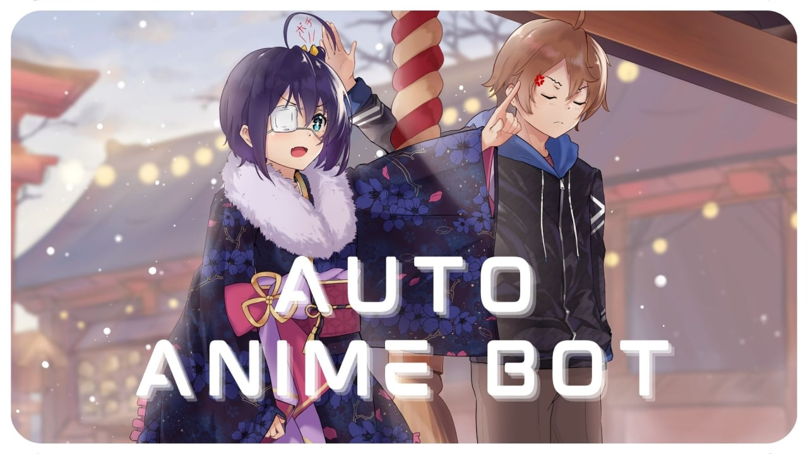

<p align="center"><a href="https://github.com/TechShreyash/AutoAnimeBot"></a></p> 

<h1 align="center"><b>AutoAnimeBot</b></h1>
<h2 align="center"><b>Automates The Process Of Managing Your Anime Channels</b></h4>

<p align="center" >  </p>

<hr>

### ♻️ Features

* Fully Automatic ( From downloading, to uploading, to posting links and info on index channel )
* Live Status and Schedule of animes
* Live Downloading and Uploading Status
* Automatic cool thumbnail generator with episode preview at background
* Light Weight and Powerfull at same time
* Powered By TechZApi and GogoAnime

<details>
<summary>🔰 CLick For More Features </summary>
<br>

- Vote buttons on each anime in index channel

- In case any errors comes ( while downloading/uploading ) bot saves which episode and which quality quality it failed, and will try reupload that if scrapped its links again

- On failing bot retries each file max 3 times

- As gogo animes downloading speed is shit, there a download timeout of 1 hour ( downloading will cancel automatically after this )

- You can add a custom sleep time for which the bot will sleep after uploading each file to avoid spam on your channel and to avoid floodwaits

- Better logs saving, you can easily view where the error came and in which file, get log file on telegram by /logs command

- Bot make sures that it has uploaded episode in all four qualities ( 360p, 480p, 720p, 1080p ), if available !!

- If [this](https://t.me/Anime_Dex/610) episode link message exceeds the tg limit of 4096 characters,  a new message will be created replying to info message of anime and new episode links will be added there

- You can click the hashtag below each file on uploads channel to get all files of that anime
</details>


<hr>

### 📚 Setup Guide

* You have to create a public uploads channel and index channel
* A group for comments (This must be linked to your index channel, Can be private or public)
* And below required variables
* Two messages on your uploads channel, one for status and one for schedule

<hr>

### 🧲 Required Variables

* `API_ID` - Get this value from my.telegram.org
* `API_HASH` - Get this value from my.telegram.org
* `BOT_TOKEN` - Get this from @BotFather
* `MONGO_DB_URI` - Get this from cloud.mongodb.com
* `STATUS_MSG_ID` - ID of the message in your Uploads Channel where the status of bot will be showed
* `SCHEDULE_MSG_ID` - ID of the message in your Uploads Channel where the Live Schedule From Subsplease will be showed
* `CHANNEL_TITLE` - Name of your channel (This will appear in thumbnail of videos)
* `INDEX_CHANNEL_USERNAME` - Username of your Index Channel
* `UPLOADS_CHANNEL_USERNAME` - Username of your Uploads Channel
* `TECHZ_API_KEY` - Your TechZApi Key, Get from [here](https://techzbots.tech/TechZApiBot)
* `COMMENTS_GROUP_LINK` - Link of your comments group (This must be linked to your index channel)

<hr>

### 📝 Deploy

* Deploy on Heroku
    
    <a href="https://dashboard.heroku.com/new?template=https%3A%2F%2Fgithub.com%2FTechShreyash%2FAutoAnimeBot"></a>

* Deploy on VPS

    ```
    $ git clone https://github.com/TechShreyash/AutoAnimeBot && cd AutoAnimeBot

    $ tmux

    $ pip3 install -r requirements.txt

    $ python3 -m AutoAnimeBot
    ```
<hr>

### 🚀 Bot Demo :

* Index Channel : [@Anime_Dex](https://t.me/Anime_Dex)
* Uploads Channel : [@AutoAiringAnimes](https://t.me/AutoAiringAnimes)
* Discussion Group : [Join Now](https://t.me/+4nUo4jBR-JgxMTVl)

<hr>

### 👤 Contact Me For Any Help
[](https://telegram.me/TechZBots) [](https://telegram.me/TechZBots_Support)

<hr>

### ⭐ Credits
* [TechZBots](https://t.me/TechZBots)
* [TechShreyash](https://github.com/TechShreyash)

### ⛑ Important
* [License](https://github.com/TechShreyash/AutoAnimeBot/blob/main/LICENSE)
* [Code Of Conduct](https://github.com/TechShreyash/AutoAnimeBot/blob/main/CODE_OF_CONDUCT.md)

### ❗️ You are free to use and make your own clone, but you cant sell this repo to others
